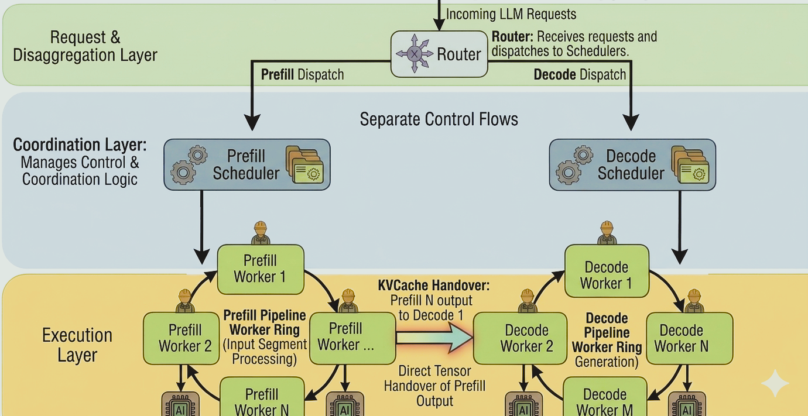

# ***TorusInfer***:  A ***T***iered ***O***rchestration ***R***ing for ***U***nified ***S***cheduling and Pipelined ***Infer***ence.
Supported Model: https://huggingface.co/Qwen/Qwen2.5-7B-Instruct
## Key Features
1. **Modular Layer Construction**: Flexible building of custom model topologies. 
2. **PagedAttention**: Optimized KV Cache management to handle long-sequence bottlenecks. 
3. **Continuous Batching**: Dynamic iteration-level scheduling to maximize throughput. 
4. **OpenAI Compatible API**: Integration with existing OpenAI API.
5. **Pipeline Parallelism**: High-efficiency model parallelism across multiple GPUs and nodes.
6. **Prefix Caching**: Drastically reduces Time-To-First-Token (TTFT) for repetitive prompts. 
7. **PD Disaggregation Architecture**: Physical separation and independent scheduling of Prefill and Decode tasks.

## Architecture Overview
### Torus Pipeleine
<p align="center">
  
</p>

<p align="center">
  <em>Overall serving system architecture.</em>
</p>

---

### Prefill-Decode Disaggregation

<p align="center">
  
</p>

<p align="center">
  <em>Separated prefill and decode worker pipeline for high throughput serving.</em>
</p>

## Requirements and Dependencies
### Environment
* **OS:** Ubuntu 20.04 / 22.04 LTS
* **Python:** 3.10 (Safe: 3.10.12)
* **CUDA Toolkit:** 12.x (Safe: 12.4)
* **C++ Standard:** C++17 

### Core Libraries
* **Frontend:** FastAPI, Uvicorn, Starlette, Pydantic (OpenAI-compatible API)
* **Binding:** pybind11 (C++/Python interoperability)
* **Model Handling:** Tokenizers, Git-LFS (for weight management)

### Hardware Note
Tested on V100. But V100 does not support native BF16, In kernel BF16 transition to FP32.

## Quick Start  
### 1. Environment Setup
```
# Clone the repository
git clone https://github.com/Learnrr/TorusInfer.git
cd TorusInfer 

# Download weights 
cd weights  
git lfs clone https://huggingface.co/Qwen/Qwen2.5-7B-Instruct
cd ..
```
### 2. Compilation
```
make clean && make all
```

### 3. Serving
<details> 
<summary><b>Option A: Single Worker Deployment (Click to expand)</b></summary>

1. Configure Worker: Edit llm_engine_config_worker0.json.  

2. Configure Scheduler: Edit llm_engine_config_scheduler.json.  

3. Start Processes:

```
# Terminal 1: Start Worker
python3 -m python.worker_service --config ./llm_engine_config_worker0.json  

# Terminal 2: Start Scheduler
python3 -m uvicorn python.scheduler_service:app --host 0.0.0.0 --port 8000 --workers 1
```
</details>

<details>
<summary><b>Option B: Multi-Worker Pipeline Parallel (Click to expand)</b></summary>

Example with 2 Workers:

1. Configure Workers: Set distinct pipeline_rank (0 and 1) and local_device_id.   

2. Start all Workers:
```
# Terminal 1: Start Worker0
python3 -m python.worker_service --config ./llm_engine_config_worker0.json

# Terminal 1: Start Worker
python3 -m python.worker_service --config ./llm_engine_config_worker1.json
```
3. Start Scheduler:
```
# Terminal 3: Start Scheduler
python3 -m uvicorn python.scheduler_service:app --host 0.0.0.0 --port 8000 --workers 1
```
</details>

<details>
<summary><b>Option C: PD Disaggregation (Click to expand)</b></summary>

1. Start Prefill Node:
```
# Terminal 1: Start Prefill Worker
python3 -m disaggregation.worker_service --config disaggregation/llm_engine_config_prefill_worker.json

# Terminal 2: Start Prefill Scheduler
python3 -m disaggregation.scheduler_service --config disaggregation/llm_engine_config_prefill_scheduler.json
```
2. Start Decode Node:
```
# Terminal 3: Start Decode Worker
python3 -m disaggregation.worker_service --config disaggregation/llm_engine_config_decode_worker.json

# Terminal 4: Start Decode Sc+heduler
python3 -m disaggregation.scheduler_service --config disaggregation/llm_engine_config_decode_scheduler.json
```
3. Start Router:
```
# Terminal 5: Start Router
python3 -m disaggregation.router_service --config disaggregation/llm_engine_config_router.json --host 0.0.0.0 --port 8000
```
</details>


## API Usage
Once the service is running, you can test the API using standard OpenAI format via curl:
```
curl -s http://127.0.0.1:8000/v1/chat/completions   -H 'Content-Type: application/json'   -d '{
    "model":"qwen",
    "messages":[
      {"role":"user","content":"what is the weather like today."}
    ],
    "max_tokens":32,
    "temperature":0.7
  }'
```

## Benchmark
Run high-concurrency performance tests using the built-in script:
```
python3 benchmark/benchmark_concurrency.py \
  --base-url [http://127.0.0.1:8000](http://127.0.0.1:8000) \
  --prompt "Write a short poem." \
  --requests 50 \
  --concurrency 8 \
  --max-tokens 128
```

## Acknowledgements
1. half： include/half_float/half.hpp: http://half.sourceforge.net  
2. json: include/nlohmann/json.hpp: https://github.com/nlohmann/json  
3. PagedAttention: https://github.com/vllm-project/vllm
4. architecture picture generated by Google Gemini


