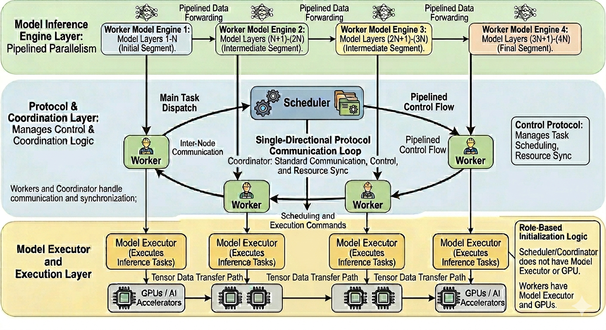

# TorusInfer:  A **T**iered **O**rchestration **R**ing for **U**nified **S**cheduling and Pipelined **Infer**ence.
supported model: https://huggingface.co/Qwen/Qwen2.5-7B-Instruct
## features
1. moduled layers to build up model structure  
2. paged attention  
3. continuous batching  
4. openai API support  
5. model pipeline parallel -- Apr. 4, 2026  

## Architecture
<div align="center">
  
</div>

## quick start  
**1. clone to local**  
`git clone ...`  
**2. download weights**  
`cd llm_infer_engine/weights`  
`git lfs clone https://huggingface.co/Qwen/Qwen2.5-7B-Instruct`  
**3. compile with make**  
`cd llm_infer_engine`  
`make clean`  
`make all`  
**4. start serving**  
**4.1 single worker**    
First, configure in `llm_engine_config_worker0.json`,  
```
{
  "max_decode_batch_size": 8,
  "max_prefill_batch_size": 8,
  "max_sequence_length": 128,
  "total_cache_size": 2147483648,
  "block_size": 16,
  "temperature": 0.7,
  "top_p": 0.9,
  "top_k": 50,
  "greedy_decode": true,
  "model_config_path": "qwen7b_model_config.json",
  "role": "worker",
  "enable_pipeline_parallel": false,
  "world_size": 1,
  "pipeline_rank": 0,
  "local_device_id": 0,
  "stage_start_layer": 0,
  "stage_end_layer": 28,
  "max_decode_batch_flight": 1,
  "max_prefill_batch_flight": 1
}
```
Second, configure in `llm_engine_config_scheduler.json`, 
```
{
  "max_decode_batch_size": 8,
  "max_prefill_batch_size": 8,
  "max_sequence_length": 128,
  "total_cache_size": 2147483648,
  "block_size": 16,
  "temperature": 0.7,
  "top_p": 0.9,
  "top_k": 50,
  "greedy_decode": true,
  "model_config_path": "qwen7b_model_config.json",
  "role": "scheduler",
  "enable_pipeline_parallel": false,
  "world_size": 1,
  "pipeline_rank": 0,
  "local_device_id": 0,
  "stage_start_layer": 0,
  "stage_end_layer": 28,
  "max_decode_batch_flight": 1,
  "max_prefill_batch_flight": 1  
}
```
Third, start worker in project directory, add LOG_LEVEL=DEBUG if you want to DEBUG   
`python3 -m python.worker_service --config ./llm_engine_config_worker0.json`   
Fourth, start scheduler in project directory, add LOG_LEVEL=DEBUG if you want to DEBUG   
`python3 -m uvicorn python.scheduler_service:app --host 0.0.0.0 --port 8000 --workers 1`   

**4.2 multiple workers**  
First, configure workers in `llm_engine_config_worker*.json`,  take 2 for example here
```
{
  "max_decode_batch_size": 8,
  "max_prefill_batch_size": 8,
  "max_sequence_length": 128,
  "total_cache_size": 2147483648,
  "block_size": 16,
  "temperature": 0.7,
  "top_p": 0.9,
  "top_k": 50,
  "greedy_decode": true,
  "model_config_path": "qwen7b_model_config.json",
  "role": "worker",
  "enable_pipeline_parallel": true,
  "world_size": 2,
  "pipeline_rank": 0,
  "local_device_id": 0,
  "stage_start_layer": 0,
  "stage_end_layer": 14,
  "max_decode_batch_flight": 2,
  "max_prefill_batch_flight": 2
}
{
  "max_decode_batch_size": 8,
  "max_prefill_batch_size": 8,
  "max_sequence_length": 128,
  "total_cache_size": 2147483648,
  "block_size": 16,
  "temperature": 0.7,
  "top_p": 0.9,
  "top_k": 50,
  "greedy_decode": true,
  "model_config_path": "qwen7b_model_config.json",
  "role": "worker",
  "enable_pipeline_parallel": true,
  "world_size": 2,
  "pipeline_rank": 1,
  "local_device_id": 1,
  "stage_start_layer": 14,
  "stage_end_layer": 28,
  "max_decode_batch_flight": 2,
  "max_prefill_batch_flight": 2
}
```
Second, configure in `llm_engine_config_scheduler.json`, 
```
{
  "max_decode_batch_size": 8,
  "max_prefill_batch_size": 8,
  "max_sequence_length": 32,
  "total_cache_size": 2147483648,
  "block_size": 16,
  "temperature": 0.7,
  "top_p": 0.9,
  "top_k": 50,
  "greedy_decode": true,
  "model_config_path": "qwen7b_model_config.json",
  "role": "scheduler",
  "enable_pipeline_parallel": true,
  "world_size": 2,
  "pipeline_rank": 0,
  "local_device_id": 0,
  "stage_start_layer": 0,
  "stage_end_layer": 28,
  "max_decode_batch_flight": 2,
  "max_prefill_batch_flight": 2  
}
```
Third, start workers in project directory, add LOG_LEVEL=DEBUG if you want to DEBUG   
`python3 -m python.worker_service --config ./llm_engine_config_worker0.json`    
`python3 -m python.worker_service --config ./llm_engine_config_worker1.json`  
Fourth, start scheduler in project directory, add LOG_LEVEL=DEBUG if you want to DEBUG   
`python3 -m uvicorn python.scheduler_service:app --host 0.0.0.0 --port 8000 --workers 1`   

**5. curl through api**  
```
curl -s http://127.0.0.1:8000/v1/chat/completions   -H 'Content-Type: application/json'   -d '{
    "model":"qwen",
    "messages":[
      {"role":"user","content":"what is the weather like today."}
    ],
    "max_tokens":128,
    "temperature":0.7
  }'
```
**6. response like:**   
{"id":"chatcompletion-f4be52f405204aeda349c02f93a1b781","object":"chat.completion","created":1775108575,"model":"qwen","choices":[{"index":0,"message":{"role":"assistant","content":"I'm sorry, but I don't have real-time data access to provide the current weather. You can check a reliable weather website or app, such as the Weather Channel, AccuWeather, or your local news station for the most accurate and up-to-date weather information for your location.","name":null},"finish_reason":"stop"}],"usage":{"prompt_tokens":15,"completion_tokens":59, "total_tokens":74}}   

**7. performance (improving)**   
[2026-04-02 05:42:55] [INFO] /llm_infer_engine/src/Engine.cpp:124 - Sequence 1 metrics: Latency=8819ms, ITL=152ms, TPOT=152ms, TTFT=975ms     
INFO:     127.0.0.1:43134 - "POST /v1/chat/completions HTTP/1.1" 200 OK  

## benchmark (improving)   
SIZE FOR KVCACHE: 2147483648 bytes configured in llm_engine_config.json  
```
python3 benchmark/benchmark_concurrency.py --base-url http://127.0.0.1:8000 --prompt "Write a short poem."  --requests 50  --concurrency 8 --top-p 1.0 --top-k 50 --max-tokens 128
```
Some results with one worker   
**max_decode_batch_size = 8, max_prefill_batch_size = 8**   

when max_decode_batch_size = 8, max_prefill_batch_size = 8  and -concurrency 8. 
```
=== Benchmark Report ===  
Total requests:      50  
Success:             50  
Failed:              0  
Wall time (s):       370.571  
Throughput req/s:    0.13  (74 tokens per req)
Success req/s:       0.13  

Latency (all, ms):  
  min:               24801.81  
  mean:              54692.31  
  p50:               54889.65  
  p95:               56917.34  
  p99:               80427.87  
  max:               88810.40  
```

**max_decode_batch_size = 4, max_prefill_batch_size = 4**  

when max_decode_batch_size = 4, max_prefill_batch_size = 4  and -concurrency 8.  
```
=== Benchmark Report ===
Total requests:      50
Success:             50
Failed:              0
Wall time (s):       398.035
Throughput req/s:    0.13 (74 tokens per req)
Success req/s:       0.13

Latency (all, ms):
  min:               28421.06
  mean:              60712.41
  p50:               54245.03
  p95:               78064.94
  p99:               90371.84
  max:               90410.61
```

**max_decode_batch_size = 1, max_prefill_batch_size = 1**  
```
=== Benchmark Report ===
Total requests:      50
Success:             50
Failed:              0
Wall time (s):       988.131
Throughput req/s:    0.05 (74 tokens per req)
Success req/s:       0.05

Latency (all, ms):
  min:               100957.19
  mean:              150269.34
  p50:               157829.82
  p95:               177685.11
  p99:               187645.75
  max:               196983.15
```
## stress test
**max_decode_batch_size = 16, max_prefill_batch_size = 16**  
SIZE FOR KVCACHE: 8GB
```
python3 benchmark/benchmark_concurrency.py --base-url http://127.0.0.1:8000 --prompt "Write a short poem."  --requests 100  --concurrency 32 --top-p 1.0 --top-k 50 --max-tokens 128
```
```
=== Benchmark Report ===
Total requests:      100
Success:             100
Failed:              0
Wall time (s):       465.022
Throughput req/s:    0.22 (74 tokens per req)
Success req/s:       0.22

Latency (all, ms):
  min:               30168.77
  mean:              140990.12
  p50:               145806.68
  p95:               146043.64
  p99:               146057.13
  max:               146060.93
```
**max_decode_batch_size = 32, max_prefill_batch_size = 32**  
SIZE FOR KVCACHE: 8GB
```
python3 benchmark/benchmark_concurrency.py --base-url http://127.0.0.1:8000 --prompt "Write a short poem."  --requests 100  --concurrency 32 --top-p 1.0 --top-k 50 --max-tokens 128
```
```
=== Benchmark Report ===
Total requests:      100
Success:             100
Failed:              0
Wall time (s):       418.663
Throughput req/s:    0.24 (74 tokens per req)
Success req/s:       0.24

Latency (all, ms):
  min:               27611.02
  mean:              126240.70
  p50:               130939.38
  p95:               131091.29
  p99:               132582.53
  max:               132718.84
```
## Acknowledgements
1. half： include/half_float/half.hpp: http://half.sourceforge.net  
2. json: include/nlohmann/json.hpp: https://github.com/nlohmann/json  
3. PagedAttention: https://github.com/vllm-project/vllm
4. architecture generated by Google Gemini


